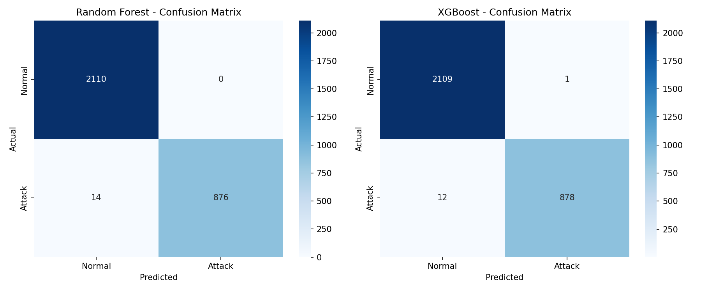
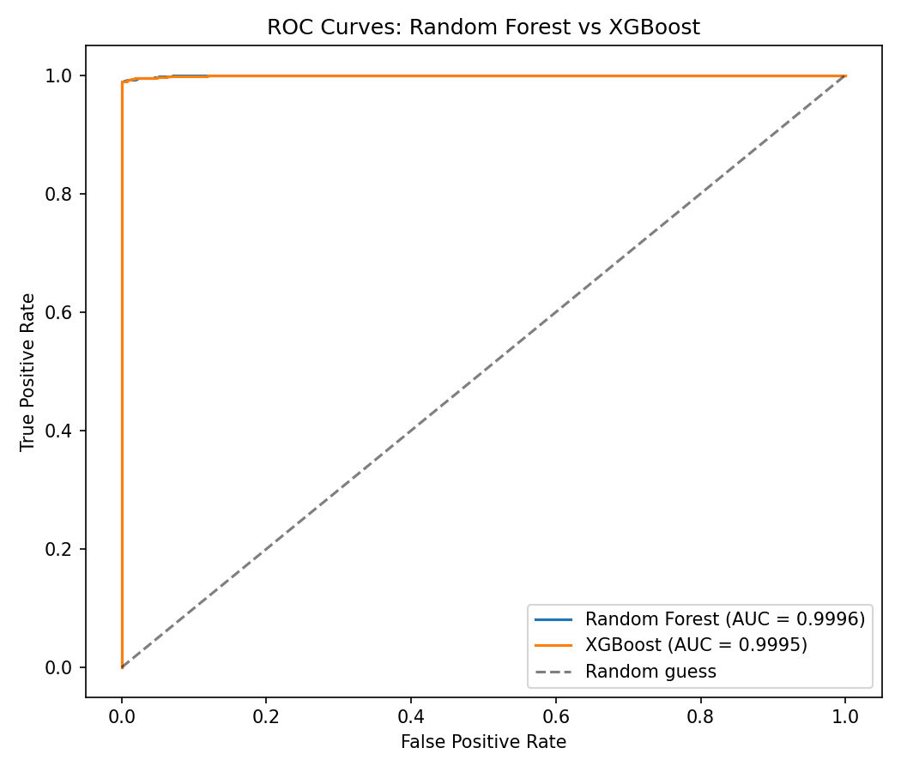
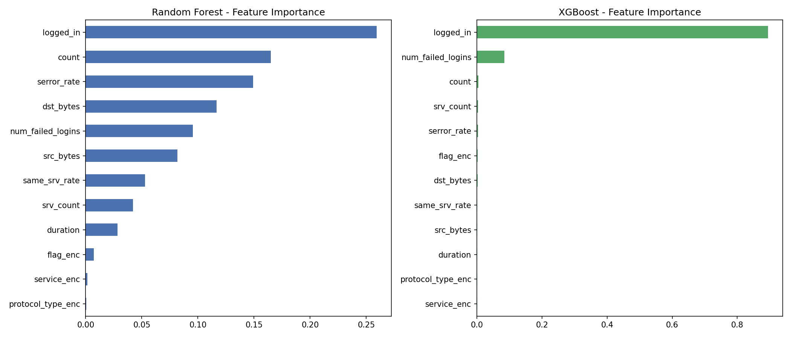
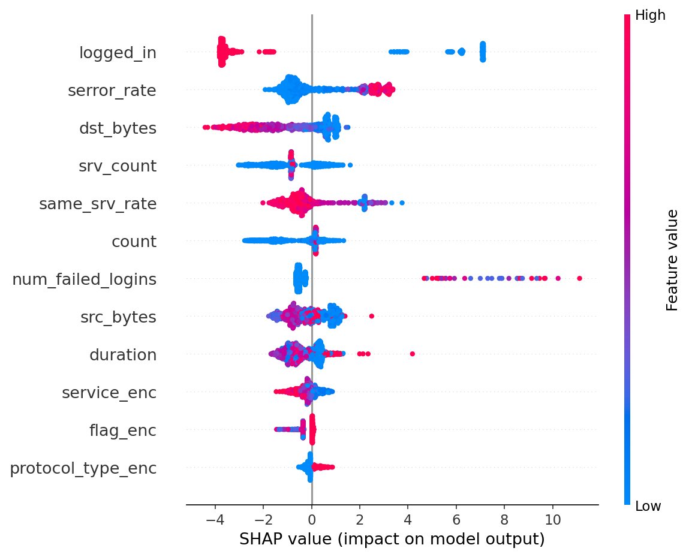

# Network Intrusion Detection

**Intern ID:** CITS4797
**Full Name:** Bumpally Abhigna Sphoorthi
**No. of Weeks:** 4 Weeks
**Company:** CodTech IT Solutions
**Domain:** Machine Learning Internship

---

## Project Name
Network Intrusion Detection

## Project Scope
Build a network intrusion detection system that classifies network
connections as normal or malicious, using classical ML models (Random
Forest and XGBoost) trained on connection-level features modeled after
the classic NSL-KDD benchmark. The system handles realistic class
imbalance (attacks are the minority class), evaluates using metrics
appropriate for a security context (precision, recall, F1, ROC-AUC —
not just accuracy), and includes SHAP-based explainability so
predictions can be audited rather than trusted blindly.

---

## Overview

Network intrusion detection is fundamentally an imbalanced
classification problem: the overwhelming majority of traffic is
legitimate, and different attack types (DoS, Probe, R2L, U2R) have very
different signatures. A naive accuracy-optimizing model can achieve high
accuracy by simply predicting "normal" most of the time — which is
useless in practice. This project builds two tree-based classifiers that
explicitly account for class imbalance, evaluates them on
security-relevant metrics, and explains individual predictions with
SHAP.

## Dataset

A synthetic dataset modeled on NSL-KDD's feature structure is generated
at runtime (`src/generate_data.py`) — 15,000 connection records with
features across three families (basic connection info, content
features, traffic features), each labeled `normal` or one of four
attack categories:

| Attack Type | Description | Rate |
|---|---|---|
| Normal | Legitimate traffic | ~70% |
| DoS | Denial of Service — high-volume, short bursts | ~18% |
| Probe | Port/network scanning | ~7% |
| R2L | Remote-to-Local — remote login attempts | ~3.5% |
| U2R | User-to-Root — privilege escalation (rarest, most severe) | ~1.5% |

Feature values are generated from attack-type-specific distributions
(e.g. DoS connections have very high `count` and `serror_rate`; Probe
connections have low `src_bytes` but many connections) so the dataset
has genuine, learnable structure rather than being random noise.

## Methodology

1. **Preprocessing** — categorical features (`protocol_type`, `service`,
   `flag`) are label-encoded; numeric features used as-is.
2. **Primary task: binary classification** (`is_attack`) — in a real
   security operations context, the first and highest-value decision is
   "is this connection worth investigating at all?" The multi-class
   attack-type label is available in the data for downstream triage.
3. **Class imbalance handling** — `class_weight='balanced'` for Random
   Forest; `scale_pos_weight` (ratio of normal:attack) for XGBoost —
   both directly compensate for attacks being the minority class rather
   than ignoring the imbalance.
4. **Models** — Random Forest (200 trees, max_depth=12) and XGBoost (200
   estimators, max_depth=6, learning_rate=0.1), compared head-to-head.
5. **Evaluation** — accuracy, precision, recall, F1, ROC-AUC, confusion
   matrix. **Recall is the metric watched most closely**: a missed
   attack (false negative) is operationally far more costly than a false
   alarm (false positive) that merely costs analyst review time.
6. **Explainability** — SHAP (TreeExplainer) on the XGBoost model,
   providing both global feature importance and per-prediction
   explanations.

## Results

| Metric | Random Forest | XGBoost |
|---|---|---|
| Accuracy | 0.9953 | 0.9960 |
| Precision | 1.0000 | 0.9989 |
| Recall | 0.9843 | 0.9876 |
| F1 | 0.9921 | 0.9932 |
| ROC-AUC | 0.9996 | 0.9995 |

XGBoost edges out Random Forest on recall and F1 — the metrics that
matter most for minimizing missed attacks — making it the preferred
model for this task, though both perform strongly.





### Feature Importance



`serror_rate` and `count` dominate both models' importance rankings —
consistent with real intrusion signatures: DoS/Probe attacks generate
many connections in a short window with a high proportion of failed
handshakes.

### SHAP Explainability



The SHAP summary plot confirms the same features driving predictions
in a directionally sensible way (e.g. high `serror_rate` pushes toward
"attack"), giving confidence the model has learned genuine attack
patterns rather than spurious correlations.

## Repository Structure

```
network-intrusion-detection/
├── data/
│   └── network_traffic.csv          # Generated synthetic dataset
├── src/
│   ├── generate_data.py             # Synthetic NSL-KDD-style data generator
│   ├── train_model.py                # RF + XGBoost training & evaluation
│   ├── visualize.py                   # EDA, confusion matrices, ROC, feature importance
│   ├── shap_analysis.py               # SHAP explainability plots
│   └── cli_demo.py                    # CLI: classify a single connection
├── notebooks/
│   └── network_intrusion_detection.ipynb   # End-to-end walkthrough
├── outputs/
│   ├── model_comparison.csv
│   ├── eda_class_distribution.png
│   ├── eda_feature_distributions.png
│   ├── confusion_matrices.png
│   ├── roc_curves.png
│   ├── feature_importance.png
│   ├── shap_summary.png
│   ├── shap_importance_bar.png
│   ├── shap_single_prediction.png
│   ├── rf_model.pkl / xgb_model.pkl / encoders.pkl / feature_cols.pkl
│   └── X_train.csv / X_test.csv / y_test.csv
├── requirements.txt
└── README.md
```

## How to Run

```bash
# 1. Install dependencies (pure-Python/pre-built wheels — no compiler needed)
pip install -r requirements.txt

# 2. Generate the synthetic dataset
python src/generate_data.py

# 3. Train both models + evaluate
python src/train_model.py

# 4. Generate EDA / evaluation visualizations
python src/visualize.py

# 5. Generate SHAP explainability plots
python src/shap_analysis.py

# 6. Try the CLI demo on a specific or random test connection
python src/cli_demo.py --index 5
python src/cli_demo.py --random
```

Or open `notebooks/network_intrusion_detection.ipynb` for the full
annotated walkthrough.

## Key Technical Decisions (Q&A)

**Why Random Forest AND XGBoost, not just one?**
Random Forest is a strong, low-variance baseline requiring minimal
tuning and is naturally interpretable via feature importances. XGBoost
typically pushes further on tabular data via sequential boosting and
handles imbalance directly through `scale_pos_weight`. Comparing both
gives a concrete, defensible basis for model selection rather than
presenting a single unquestioned result.

**Why prioritize recall over accuracy?**
With ~70% normal traffic, a model that always predicts "normal" would
score ~70% accuracy while catching zero attacks — accuracy alone is
misleading under class imbalance. Recall (of all real attacks, what
fraction did we catch?) directly measures the cost that matters most in
security: missed attacks.

**Why binary classification as the primary task, not multi-class?**
The first and most operationally urgent decision for a security analyst
is whether a connection warrants investigation at all. Multi-class
attack-type labeling is valuable for downstream triage but is secondary
to getting the binary decision right.

**Why SHAP instead of just feature importance?**
Feature importance shows what matters on average across all
predictions. SHAP explains *why this specific connection* was flagged,
which is what lets a security analyst trust and act on an individual
alert rather than treating the model as an unquestionable black box.

## Tech Stack

- Python 3.9+
- scikit-learn (Random Forest, preprocessing, metrics)
- XGBoost (gradient boosting)
- SHAP (model explainability)
- Pandas, NumPy
- Matplotlib, Seaborn

## Author

**Bumpally Abhigna Sphoorthi**
ML Intern, CodTech IT Solutions
Intern ID: CITS4797
GitHub: [Abhigna405](https://github.com/Abhigna405)
